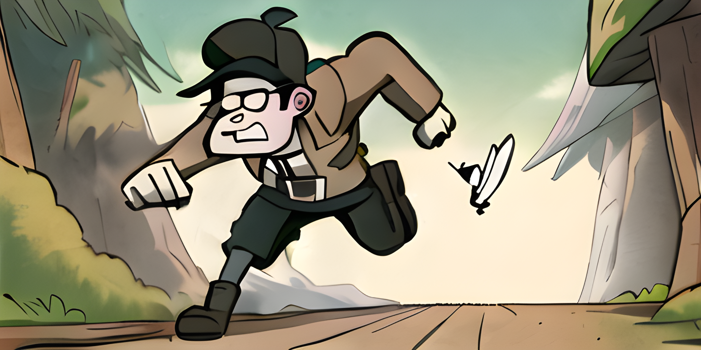

# GOOS Chase

## Groups

Completers are organized into [groups].

## Variants

And further discerned with [variants].

## Choices

Which can explicitly be selected using [choices].

[choices]:https://carapace-sh.github.io/carapace-bin/choices.html
[groups]:https://carapace-sh.github.io/carapace-bin/groups.html
[variants]:https://carapace-sh.github.io/carapace-bin/variants.html
