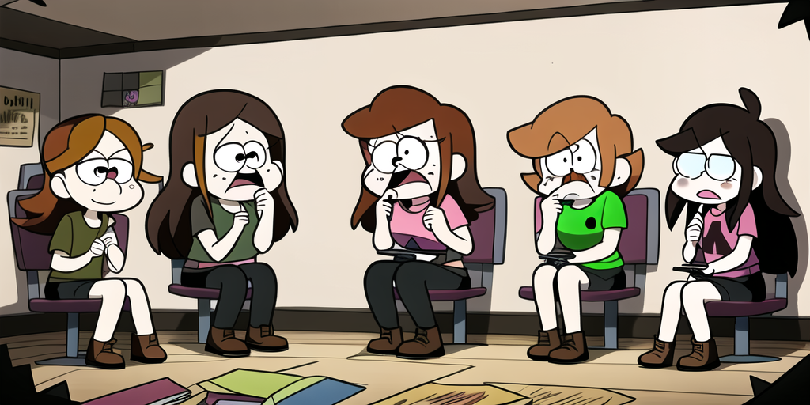

# Group Therapy

Values can not only be [styled], they can also be [tagged].
The former may signify the state of a value, and the latter classify it.

## Implicit

Subcommands are implicitly [tagged] and [styled] based on their group.

## Explicit

Other values can be [tagged] explicitly.

[styled]:https://carapace-sh.github.io/carapace/carapace/action/style.html
[tagged]:https://carapace-sh.github.io/carapace/carapace/action/tag.html
