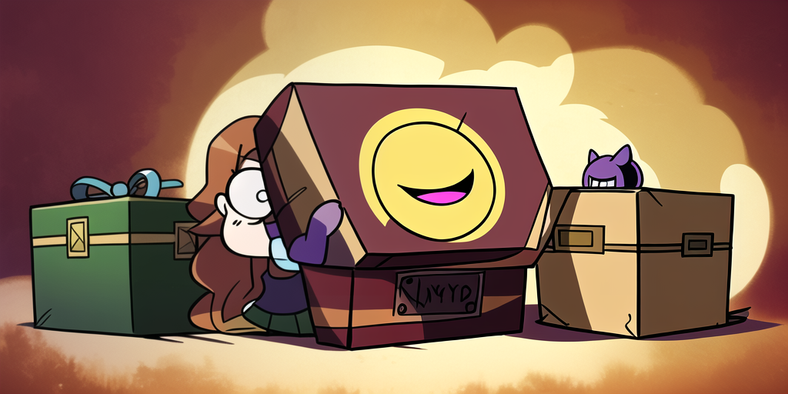

# Pandoras Box

Arguments passed to an application are positional.
This means they have a specific order in which they appear.
But some can be logically declared as [Flags].
How this is done, however, is entirely up to the author.

## POSIX

A commonly used [convention] where longhands have a `--` and shorthands a `-` prefix.
They may appear interspersed with positional arguments and some are repeatable.
Shorthands can also be chained.

## Non-POSIX

Then there are other approaches that in most cases arguably aren't a good idea.

Like shorthands with more than one character which prevents chaining.
Or the abuse of flags as subcommands.
And non-interspersed mode, which may be easier to parse, but limits UX.
Some even mix different formats.

> [Carapace] forked [pflag] to support these. But avoid them if you can.

## Dash

The `--` argument is a special case and disables flag parsing for arguments following it.
However, how it is handled differs between applications.
Many simply continue the positional arguments.
But some, like `gh repo clone`, use it for something else.

[Carapace]:https://carapace.sh
[convention]:https://www.gnu.org/software/libc/manual/html_node/Argument-Syntax.html
[embedded]:https://carapace-sh.github.io/carapace-bin/spec/embed.html
[pflag]:https://github.com/carapace-sh/carapace-pflag
[Flags]:https://en.wikipedia.org/wiki/Command-line_interface#Command-line_option
