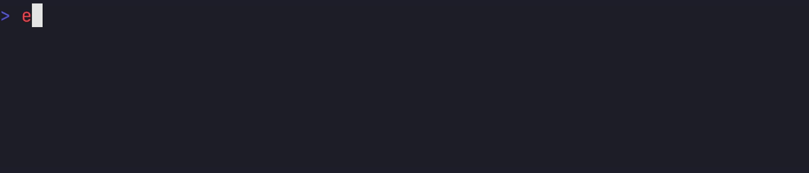

# Sandcastle

Tests ensure [Carapace] plays well with your shell.

## Assert

[Assert] compares [InvokedActions].

## Sandbox

[Sandbox] runs a command in a temporary folder and validates its output.

## VHS

[VHS] visually confirms the behaviour in a virtual terminal. 

[Assert]:https://pkg.go.dev/github.com/carapace-sh/carapace/pkg/assert
[Carapace]:https://carapace.sh
[InvokedActions]:https://carapace-sh.github.io/carapace/carapace/invokedAction.html
[Sandbox]:https://carapace-sh.github.io/carapace/carapace/sandbox.html
[VHS]:https://carapace-sh.github.io/carapace/development/vhs.html
